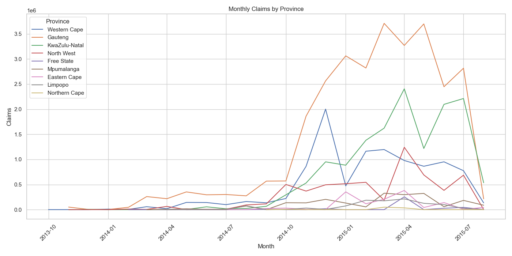

# Insurance Loss Ratio Analysis

This project analyzes insurance data to calculate and visualize loss ratios across different dimensions like provinces, vehicle types, and time periods. The loss ratio (TotalClaims/TotalPremium) is a key metric for assessing insurance profitability.

## Dataset Overview
- **Source**: `MachineLearningRating_v3.txt`
- **Records**: 1,000,098
- **Columns**: 52 (demographics, vehicle info, policy details, claims, premiums)
- **Key Metrics**: 
  - `TotalPremium`: Policy premium amounts
  - `TotalClaims`: Associated claim amounts
  - `LossRatio`: Claims/Premiums ratio

## Data Processing
1. **Initial Cleaning**:
   - Converted pipe-delimited text to CSV
   - Handled mixed data types in columns 32 & 37
   - Parsed dates in `TransactionMonth`

2. **Missing Data**:
   - Dropped columns with >90% missing values
   - Filled missing values in:
     - `AccountType`: 'Unknown'
     - `Gender`: 'Unknown'
     - `VehicleType`: 'Unknown'

3. **Feature Engineering**:
   - Created `LossRatio` metric
   - Handled infinite/NA values by setting to 0

## Key Findings

### Provincial Analysis

- **Highest Loss Ratios**:
  - Gauteng (0.26)
  - Limpopo (0.25)
  - Mpumalanga (0.24)
- **Lowest Loss Ratios**:
  - Free State (0.08)
  - Northern Cape (0.12)

### Claims Distribution

- Most claims are zero (no claims)
- Heavy right skew with some extreme values

### Monthly Trends

- Shows volatility in loss ratios over time
- Potential seasonality patterns

## Technical Details
```python
# Core calculations
df['LossRatio'] = df['TotalClaims'] / df['TotalPremium']
df['LossRatio'].replace([np.inf, -np.inf, np.nan], 0, inplace=True)


# Visualization code
sns.barplot(data=df, x='Province', y='LossRatio', estimator='mean')
plt.xticks(rotation=45)
"C:\Users\HP\Desktop\Tenx\week3\acis_insurance\monthly_claims_trend.png"
## Key Features
- Monthly claim trend visualization
- Provincial claim comparison
- Data cleaning pipeline for insurance records
- Exportable results (CSV/PNG)

## Updated Analysis

### Monthly Claims Trend

- **Pattern**: Shows seasonality and claim spikes
- **Usage**: 
  ```python
  sns.lineplot(data=monthly_claims, x='Month', y='TotalClaims', marker='o')
  